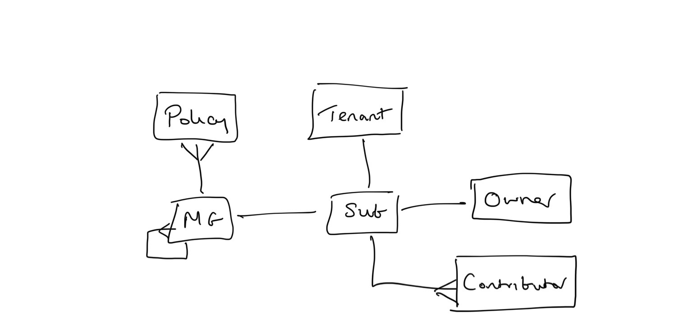

# Governance

# Governance

### Subscriptions

Subscriptions trusts Azure AD to authenticate users, services and devices
Subscriptions can ONLY trust ONE directory

### Management groups

One reason to create a management group is to bundle subscriptions together. Only management groups and subscriptions can be made children of another management group. A subscription that moves to a management group inherits all user access and policies from the parent management group.

To move the subscription, all of the following RBAC permissions need to be true:
* "Owner" role on the child subscription.
* "Owner", "Contributor", or "Management Group Contributor" role on the target parent management group.
* "Owner", "Contributor", or "Management Group Contributor" role on the existing parent management group.

If the target or the existing parent management group is the Root management group, the permissions requirements don't apply. Since the Root management group is the default landing spot for all new management groups and subscriptions, you don't need permissions on it to move an item.

If the Owner role on the subscription is inherited from the current management group, your move targets are limited. You can only move the subscription to another management group where you have the Owner role. You can't move it to a management group where you're a contributor because you would lose ownership of the subscription. If you're directly assigned to the Owner role for the subscription (not inherited from the management group), you can move it to any management group where you're a contributor.

To see what permissions you have in the Azure portal, select the management group and then select IAM. To learn more on RBAC Roles, see Manage access and permissions with RBAC.

[[aad.md]]
[//begin]: # "Autogenerated link references for markdown compatibility"
[aad]: aad "Azure Active Directory"
[//end]: # "Autogenerated link references"
