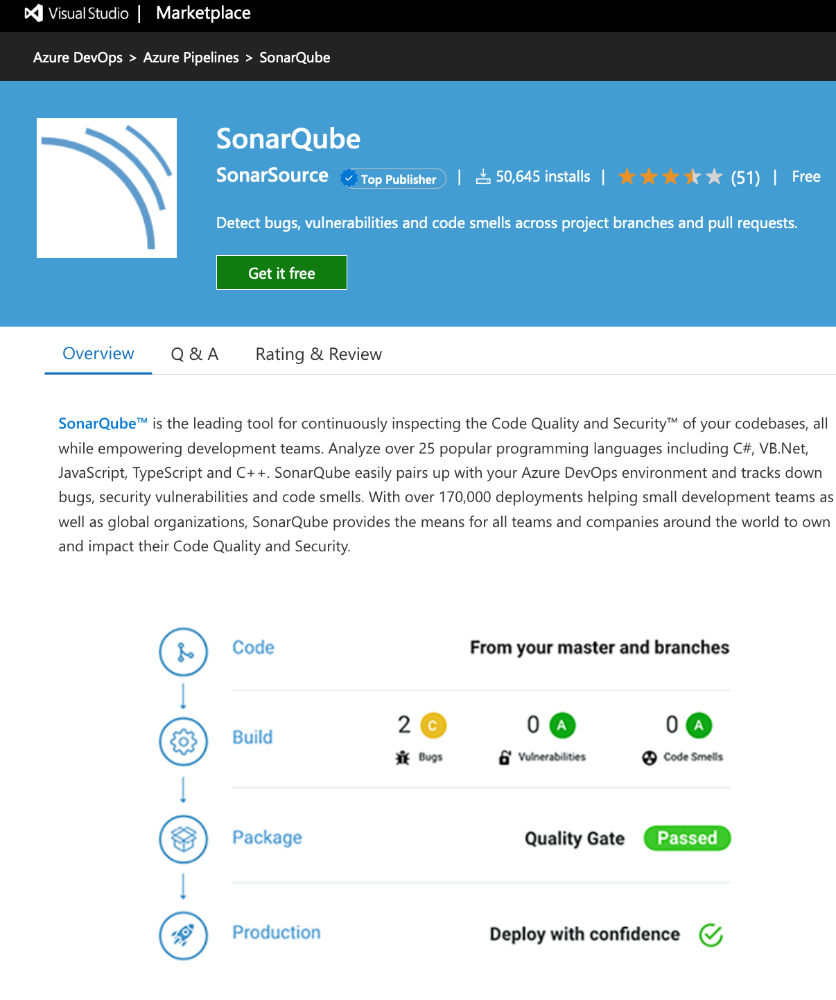

# Sonarqube

## 1. Install AZDO plug-in from the AZDO marketplace



# 2. Edit the .yaml build

```YAML
parameters:
  - name: SQProjectKey
    displayName: "SonarQube Key"
    type: string
    default: abcdefghijklmnopqrstuvwxyz
  - name: SQConnectionName
    displayName: "SonarQube Connection Name"
    type: string
    default: 'SQ - My AZDO SonarQube Service Connection Name'
  - name: RunSQ
    displayName: "Run SonarQube"
    type: boolean
    default: true
  - name: SQProjectName
    displayName: "My Project Display Name in SQ"
    type: boolean
    default: 'Test Project'

variables:
    runSQ: ${{ parameters.RunSQ }}

- ${{ if and(eq(variables['Build.SourceBranch'], 'refs/heads/master'), eq(variables['RunSQ'], 'true')) }}:
  - task: SonarQubePrepare@4
  displayName: 'Prepare analysis on SonarQube'
                inputs:
                  SonarQube: ${{ parameters.SQConnectionName }}
                  projectKey: ${{ parameters.SQProjectKey }}
                  projectName: ${{ parameters.SQProjectName }}
                  extraProperties: |
                    # Additional properties that will be passed to the scanner, 
                    # Put one key=value per line, example:
                    # sonar.exclusions=**/*.bin
                    # sonar.sources=src

# do you build tasks here and collect the SQ results afterwards

- ${{ if eq(variables['Build.SourceBranch'], 'refs/heads/master') }}:
  - task: SonarQubeAnalyze@4
    displayName: 'Run Code Analysis'

- ${{ if eq(variables['Build.SourceBranch'], 'refs/heads/master') }}:
  - task: SonarQubePublish@4
    displayName: 'Publish Quality Gate Result'
```

## Things to remember

- Prepare SQ, build, Analysis SQ, Publish SQ
- if you build a `.sln` then all should be well, but if you are building projects, then each project needs a `<ProjectGuid>` element in the `<ProjectGroup>` of the project. 
    ```xml
    <PropertyGroup>
        <TargetFramework>netcoreapp3.1</TargetFramework>
        <ProjectGuid>xxxxxxxx-xxxx-xxxx-xxxx-xxxxxxxxxxxx</ProjectGuid>
    </PropertyGroup>
    ```

    When SonarQube analyses by the `.sln` it is capable of tracking projects itself, but if you are building by projects then you must help SonarQube keep track of the projects by using a unique `ProjectGuid` for each project.

